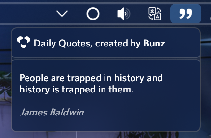

<link rel="stylesheet" href="https://cdnjs.cloudflare.com/ajax/libs/font-awesome/4.7.0/css/font-awesome.min.css">

<h1 align="center">
   
  
   
  Daily Quotes - Bunz
   
</h1>

<h4 align="center">Small description of your app.</h4>

  
  
  
  

  <a href="#key-features">Key Features</a> •
  <a href="#how-to-use">How To Use</a> •
  <a href="#download">Download</a> •
  <a href="#credits">Credits</a> •
  <a href="#license">License</a>

## Key Features

I have readjusted the <a href="https://www.deviantart.com/eclectic-tech/art/Illustro-Quotes-Patch-1-1-2015-11-11-564733769">Illustro Quotes</a> skin by <a href="https://www.deviantart.com/eclectic-tech">Eclectic-Tech</a> to fit in the app and in the <a href="https://www.deviantart.com/cariboudjan/art/droptop-four-762812007">Droptop Four</a> style, and in future updates I'm going to increse the features that this app offers.

## How to use

Scroll on the quote box to change the displayed quote.

## Download

To use the Daily Quotes app you need to install <a href="https://www.deviantart.com/cariboudjan/art/droptop-four-762812007">Droptop Four</a>. There are 2 ways to install this Rainmeter package:
<ul>
    <li>The first way is downloading the *.rmskin* package from <a href="https://github.com/66Bunz/DroptopFour-DailyQuotes/releases" target="_blank">the GitHub releases</a>. Opening the file will open the installer and, after making shure that the option *Load included skins* is ticked to open the readme document with the guide, you can click on install.</li>
  <li>The second way is cloning this repository in the <em>Droptop Community Apps</em> directory "<code>\Rainmeter\Skins\Droptop Community Apps</code>"</li>
</ul>

## Credits

<a href="https://www.deviantart.com/eclectic-tech"><b>Eclectic-Tech</b></a>:
- <a href="https://www.deviantart.com/eclectic-tech/art/Illustro-Quotes-Patch-1-1-2015-11-11-564733769">Illustro Quotes</a> (I readjusted the his code to fit in the app)

Icons from <a href="https://www.flaticon.com/"><b>Flaticon.com</b></a>

## License

<a href="https://www.gnu.org/licenses/gpl-3.0.html">GNU General Public License v3.0</a> 
Feel free to modify or redistribute these Rainmeter skins as much as you want. Just:
- Link back to me somehow
- Use ths same license
